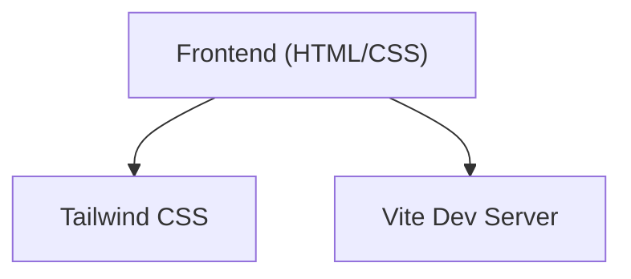

## 1. Architecture Design

## 2. Technology Description
- Frontend: HTML5 + Tailwind CSS v3 + Vanilla JS (for simple interactions like FAQ accordion and scroll animations).
- Initialization Tool: Vite (Vanilla template).
- The user explicitly requested "talwind css and html".

## 3. Route Definitions
| Route | Purpose |
|-------|---------|
| / | Home page with main content |

## 4. API Definitions
N/A - Static Landing Page

## 5. Server Architecture Diagram
N/A - Static Landing Page

## 6. Data Model
N/A
