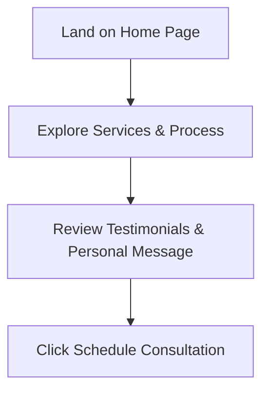

## 1. Product Overview
A modern, luxury "Silicon Valley Fintech" style landing page for NOVIRE financial consulting.
- The page aims to provide a high-end, professional online presence to attract individuals and business owners seeking trusted financial guidance.
- Target value: Build trust, highlight expertise, and drive conversions for one-on-one consultations.

## 2. Core Features

### 2.1 Feature Module
1. **Home page**: Hero section, Trust Strip, About, Services, How It Works, Why Choose Us, Results, Testimonials, Financial Insights, FAQ, Final CTA, Personal Message, Footer.

### 2.2 Page Details
| Page Name | Module Name | Feature description |
|-----------|-------------|---------------------|
| Home page | Hero Section | Headline, supporting text, dual CTAs, floating stats. |
| Home page | Trust Strip | Grid of core values/benefits. |
| Home page | About Section | Owner introduction with side quote. |
| Home page | Services | Grid displaying 4 core financial services. |
| Home page | How It Works | Step-by-step process timeline/grid. |
| Home page | Why Choose Us | 6-card masonry or grid layout of benefits. |
| Home page | Results | Emphasizes client outcomes and focus. |
| Home page | Testimonials | Client quotes building social proof. |
| Home page | Financial Insights | Educational resource cards. |
| Home page | FAQ | Accordion-style frequently asked questions. |
| Home page | Personal Message | Owner portrait and heartfelt message. |
| Home page | Final CTA & Footer | Booking prompts and footer links. |

## 3. Core Process
User lands on the page -> Learns about the expert and services -> Reviews social proof and process -> Books a consultation via CTA buttons.

## 4. User Interface Design
### 4.1 Design Style
- **Primary Colors**: Dark theme base (deep charcoal/black) with elegant accents (e.g., gold or emerald/teal for trust).
- **Typography**: Distinctive, elegant display fonts paired with clean, readable sans-serif body text.
- **Layout style**: Clean, centered, and balanced layouts. High-fidelity visuals with masonry grids, generous negative space, and professional SVG icons (no emojis).
- **Aesthetic**: Elite, luxury, Silicon Valley Fintech. Minimalist but impactful.

### 4.2 Page Design Overview
| Page Name | Module Name | UI Elements |
|-----------|-------------|-------------|
| Home page | All Sections | Dark background, subtle gradients/noise textures, sophisticated fade-in animations on scroll, glassmorphism cards. |

### 4.3 Responsiveness
Desktop-first, mobile-adaptive, touch optimization for smaller devices.
